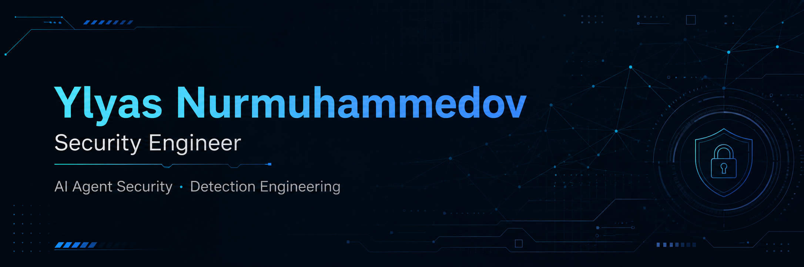

<!-- GitHub profile README: github.com/Ylyass -->

  

  I build security controls for AI agents and systems where a small mistake can become a high-impact action.
   
  My work focuses on least privilege, explainable enforcement, detection engineering, and reproducible security testing.

  
  
  

## Flagship project

### [MCP Privilege Profiler](https://github.com/Ylyass/mcp-privilege-profiler)

**A human-reviewed, least-privilege security proxy for MCP-based AI agents.**

AI agents often receive access to more tools than one task requires. MCP Privilege Profiler sits between an agent host and an MCP tool server, profiles the tools used by a task, and turns that evidence into a policy that a person must review before enforcement.

  

<table>
<tr>
<td width="58%" valign="top">

#### What it does

- Exposes only the tools approved for the task
- Enforces `ALLOW`, `REQUIRE_APPROVAL`, and `DENY`
- Applies reviewed path, host, argument, rate, and task limits
- Detects security-relevant changes to tool definitions
- Fails closed when policy, audit, approval, or catalog checks fail
- Produces privacy-minimized JSONL events for Wazuh

</td>
<td width="42%" valign="top">

#### Verified evidence

- **164** passing Python tests
- **75/75** deterministic benchmark cases
- Linux and Windows CI on Python 3.13 and 3.14
- Real Claude Code profiling and enforced runs
- Safe local demo with no credentials or Docker

</td>
</tr>
</table>

  
  
  
  

`Python 3.13/3.14` · `MCP Python SDK 2.0` · `Pydantic` · `SQLite` · `AnyIO` · `pytest` · `Hypothesis` · `Wazuh 4.14.6`

---

## Other selected work

<table>
<tr>
<td width="50%" valign="top">

### [LLM Red Team Assessment](https://github.com/Ylyass/LLM-RedTeam-assessment)

**Controlled jailbreak testing of a local Llama 3.2 model.**

I ran a baseline Garak assessment, designed a prompt-level mitigation, repeated the same test suite, and compared the results. The DAN module resistance score moved from **22% to 21%**, showing that the tested prompt-only defence did not improve this attack class.

`Garak` · `Ollama` · `OWASP LLM01` · `Adversarial testing`

[Read the assessment →](https://github.com/Ylyass/LLM-RedTeam-assessment/blob/main/assessment_report.md)

</td>
<td width="50%" valign="top">

### [Swinburne Campus Mobile App](https://github.com/islam-mamedov/Final-Year-Project-B)

**Cross-platform campus navigation and student-support application.**

My work included backend route logic, assistant-service integration, request filtering, API rate limiting, JWT authentication, database Row-Level Security, security testing, and technical documentation.

`Next.js` · `TypeScript` · `Capacitor` · `Supabase` · `RLS`

[Open the live application →](https://final-year-project-b-dx9c.vercel.app/)

</td>
</tr>
</table>

---

## What I work with

| AI and agent security | Security engineering | Detection and validation |
|---|---|---|
| MCP security, prompt injection, jailbreak assessment, tool-use controls | Least privilege, policy enforcement, fail-closed design, audit logging, RBAC | Wazuh, Sysmon, Windows Event Logs, MITRE ATT&CK, alert investigation |
| Claude Code, Garak, Ollama, OWASP LLM Top 10 | Python, Pydantic, SQLite, APIs, rate limiting, Row-Level Security | pytest, Hypothesis, Ruff, Pyright, GitHub Actions, Docker |

## Background

- Cybersecurity graduate, Swinburne University of Technology, 2026
- Cisco Networking Academy training in CyberOps and the CCNA pathway
- Hands-on work across AI security, secure software architecture, SIEM monitoring, cloud security, networking, and automation

---

  I am interested in security engineering, AI and agent security, and detection engineering opportunities.
   
  If you are building governed AI agents or working on MCP security, I would be glad to connect.

  <a href="https://portfolio-ylyass-projects.vercel.app/">Portfolio</a>
  ·
  <a href="https://www.linkedin.com/in/ylyasnurmuhammedov">LinkedIn</a>
  ·
  <a href="mailto:nurmuhammedovylyas0909@gmail.com">Email</a>

