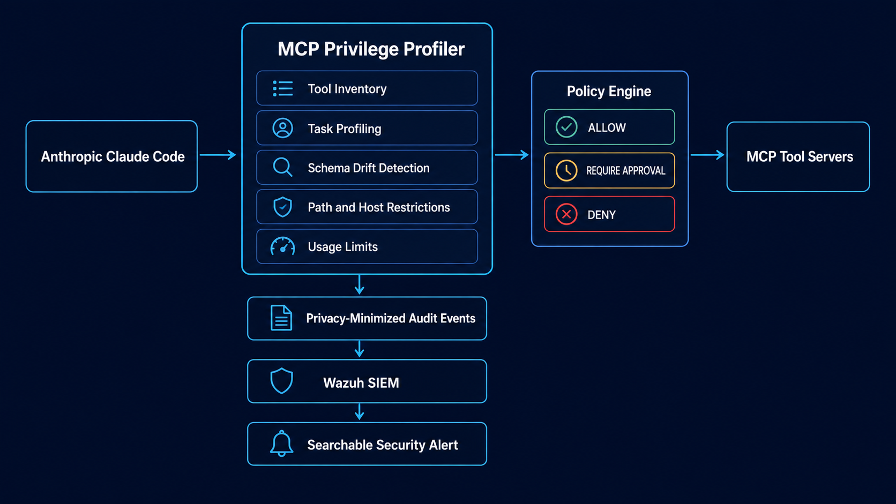

<!-- GitHub profile README: github.com/Ylyass -->

  

  
  
  

---

## Selected Work

### MCP Privilege Profiler

**Least-privilege security proxy for AI agents**

A Python 3.13 security proxy positioned between AI-agent hosts and MCP tool servers. It profiles the tools required for a task, restricts unnecessary access, detects changes to tool definitions, and exports privacy-minimized security events to Wazuh.

**Implemented controls**

- `ALLOW`, `REQUIRE_APPROVAL`, and `DENY` decisions
- Task-specific tool permissions
- Filtered tool visibility
- Path and host restrictions
- Usage limits
- Schema-drift detection
- Fail-closed handling
- Human-review controls
- Wazuh audit events

**Current results**

- Integrated with Anthropic Claude Code
- Completed two controlled dependency-review runs
- Captured six successful MCP tool calls
- Validated blocked actions through searchable Wazuh alerts
- 159 automated tests passing
- Security, integration, property, and benchmark testing

**Status:** In development  
**Stack:** Python 3.13 · MCP Python SDK · Pydantic · SQLite · Docker · Wazuh · pytest · Hypothesis

> Runs locally. The public repository will be linked after the source code and documentation are ready.

### Architecture

  

---

<table>
<tr>
<td width="50%" valign="top">

### [LLM Red Team Assessment](https://github.com/Ylyass/LLM-RedTeam-assessment)

**Adversarial testing of a locally hosted Llama 3.2 model**

A repeatable Garak assessment covering jailbreak and prompt-injection behaviour.

- Documented test environment
- Baseline and mitigated runs
- Successful and failed cases
- Failure-pattern analysis
- OWASP LLM01 mapping
- Before-and-after comparison
- Remaining risks and limitations

**Status:** Completed  
**Scope:** Garak · Llama 3.2 · OWASP LLM01

[View repository](https://github.com/Ylyass/LLM-RedTeam-assessment)

</td>

<td width="50%" valign="top">

### Wazuh SIEM Home Lab

**Windows endpoint monitoring and detection validation**

A local lab collecting Windows Event Logs and Sysmon telemetry for process, command-line, authentication, PowerShell, and file activity.

- Simulated brute-force investigation
- Encoded PowerShell investigation
- Critical-alert review
- Process relationship analysis
- False-positive confirmation
- Scheduled-task detection gap
- Detection-improvement documentation

**Status:** Local lab  
**Stack:** Wazuh · Sysmon · Windows Event Logs · PowerShell

A public documentation repository will contain redacted screenshots, investigation reports, architecture, queries, and reusable configuration examples.

</td>
</tr>
</table>

---

### [Swinburne Campus Mobile App](https://github.com/islam-mamedov/Final-Year-Project-B)

**Cross-platform campus navigation and student-support application**

A team final-year project developed with Next.js, TypeScript, Capacitor, and Supabase.

**My contributions**

- Backend route logic
- Assistant service integration
- Request filtering
- API rate limiting
- JWT authentication
- Database Row-Level Security
- Functional and security testing
- High-request-volume testing
- Technical documentation

The application was tested with approximately 80 students and received 92% positive feedback.

  
  

---

## Technical Areas

<table>
<tr>
<td width="33%" valign="top">

### Security Engineering

`Least Privilege`  
`Policy Enforcement`  
`Fail-Closed Design`  
`Audit Logging`  
`Schema-Drift Detection`  
`RBAC`  
`Row-Level Security`  
`Rate Limiting`

</td>

<td width="33%" valign="top">

### Detection and Testing

`Wazuh`  
`Sysmon`  
`Windows Event Logs`  
`Garak`  
`OWASP LLM Top 10`  
`MITRE ATT&CK`  
`Atomic Red Team`  
`Alert Investigation`

</td>

<td width="33%" valign="top">

### Engineering Stack

`Python`  
`PowerShell`  
`Bash`  
`Docker`  
`GitHub Actions`  
`pytest`  
`Hypothesis`  
`Ruff`  
`Pyright`

</td>
</tr>
</table>

---

## Certifications and Training

| Credential | Issuer | Status |
|---|---|---|
| Cisco CyberOps Associate | Cisco Networking Academy | Completed · 2026 |
| CCNA: Introduction to Networks | Cisco Networking Academy | Completed · 2025 |
| CCNA: Switching, Routing and Wireless Essentials | Cisco Networking Academy | Completed · 2025 |
| CCNA: Enterprise Networking, Security and Automation | Cisco Networking Academy | Completed · 2025 |
| Security Analyst Pathway | TryHackMe | In progress |

---

## GitHub Activity

  

---

  <a href="https://portfolio-ylyass-projects.vercel.app/">Portfolio</a>
  ·
  <a href="https://www.linkedin.com/in/ylyasnurmuhammedov">LinkedIn</a>
  ·
  <a href="mailto:nurmuhammedovylyas0909@gmail.com">Email</a>

